[](https://classroom.github.com/a/hneiFYl3)
# DATOS DEL ALUMNO
* ### Nombre: Eduardo
* ### Apellidos: Lomas Recena
* ### Correo: elr00030@red.ujaen.es
* ### Tablero Trello: https://trello.com/b/9jO7gez1/pr%C3%A1ctica3
* ### Código de la aplicación: https://github.com/UJA-DAGIL-22-23/dagil-2022-2023-practica-3-Eduasso
## Apartado 5.j
Home de fauna
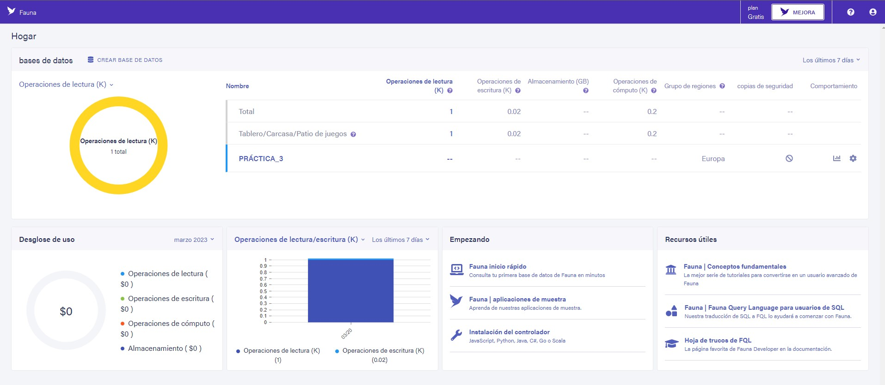
Base de datos
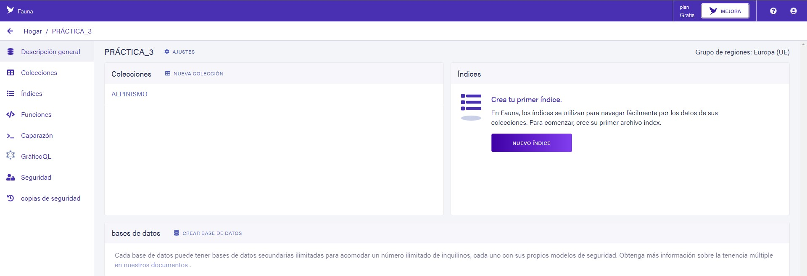
Colección
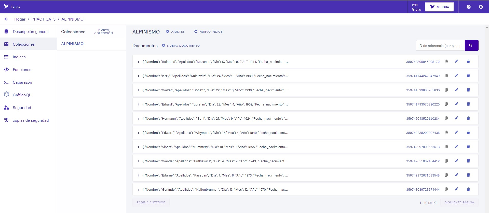

***Documento 1***

```json
{
  Nombre: "Reinhold Messner",
  Fecha_nacimiento: {
    Dia: 17,
    Mes: 9,
    Año: 1944
  },
  País: "Italia",
  Grandes_Cumbre: [
    "Everest",
    "K2",
    "Kanchenjunga",
    "Lhotse",
    "Makalu",
    "Cho Oyu",
    "Dhaulagiri",
    "Manaslu",
    "Nanga Parbat",
    "Annapura",
    "Gasherbrum I",
    "Broad peak",
    "Gasherbrum II",
    "Shisha Pangma"
  ],
  cantidad_picos_8km: 14
}
```

***Documento 2***

```json
{
  Nombre: "Jerzy Kukuczka",
  Fecha_nacimiento: {
    Dia: 24,
    Mes: 3,
    Año: 1989
  },
  País: "Polonia",
  Grandes_Cumbre: [
    "Everest",
    "K2",
    "Kanchenjunga",
    "Lhotse",
    "Makalu",
    "Cho Oyu",
    "Dhaulagiri",
    "Manaslu",
    "Nanga Parbat",
    "Annapura",
    "Gasherbrum I",
    "Broad peak",
    "Gasherbrum II",
    "Shisha Pangma"
  ],
  cantidad_picos_8km: 14
}
```

***Documento 3***

```json
{
  Nombre: "Walter Bonatti",
  Fecha_nacimiento: {
    Dia: 22,
    Mes: 6,
    Año: 1930
  },
  País: "Italia",
  Grandes_Cumbre: ["K2"],
  cantidad_picos_8km: 1
}
```

***Documento 4***

```json
{
  Nombre: "Erhard Loretan",
  Fecha_nacimiento: {
    Dia: 28,
    Mes: 4,
    Año: 1959
  },
  País: "Suiza",
  Grandes_Cumbre: [
    "Everest",
    "K2",
    "Kanchenjunga",
    "Lhotse",
    "Makalu",
    "Cho Oyu",
    "Dhaulagiri",
    "Manaslu",
    "Nanga Parbat",
    "Annapura",
    "Gasherbrum I",
    "Broad peak",
    "Gasherbrum II",
    "Shisha Pangma"
  ],
  cantidad_picos_8km: 14
}
```

***Documento 5***

```json
{
  Nombre: "Hermann Buhl",
  Fecha_nacimiento: {
    Dia: 21,
    Mes: 9,
    Año: 1924
  },
  País: "Austria",
  Grandes_Cumbre: ["Nanga Parbat", "Broad peak"],
  cantidad_picos_8km: 2
}
```

***Documento 6***

```json
{
  Nombre: "Edward Whymper",
  Fecha_nacimiento: {
    Dia: 27,
    Mes: 4,
    Año: 1840
  },
  País: "Reino Unido",
  Grandes_Cumbre: ["Cervino", "Chimborazo"],
  cantidad_picos_8km: 0
}
```

***Documento 7***

```json
{
  Nombre: "Albert Mummery",
  Fecha_nacimiento: {
    Dia: 10,
    Mes: 9,
    Año: 1855
  },
  País: "Reino Unido",
  Grandes_Cumbre: ["Cervino"],
  cantidad_picos_8km: 0
}
```

***Documento 8***

```json
{
  Nombre: "Wanda Rutkiewicz",
  Fecha_nacimiento: {
    Dia: 4,
    Mes: 2,
    Año: 1943
  },
  País: "Polonia",
  Grandes_Cumbre: [
    "Everest",
    "K2",
    "Cho Oyu",
    "Nanga Parbat",
    "Annapura",
    "Gasherbrum I",
    "Gasherbrum II",
    "Shisha Pangma"
  ],
  cantidad_picos_8km: 8
}
```

***Documento 9***

```json
{
  Nombre: "Edurne Pasaban",
  Fecha_nacimiento: {
    Dia: 1,
    Mes: 8,
    Año: 1973
  },
  País: "España",
  Grandes_Cumbre: [
    "Everest",
    "K2",
    "Kanchenjunga",
    "Lhotse",
    "Makalu",
    "Cho Oyu",
    "Dhaulagiri",
    "Manaslu",
    "Nanga Parbat",
    "Annapura",
    "Gasherbrum I",
    "Broad peak",
    "Gasherbrum II",
    "Shisha Pangma"
  ],
  cantidad_picos_8km: 14
}
```

***Documento 10***

```json
{
  Nombre: "Gerlinde Kaltenbrunner",
  Fecha_nacimiento: {
    Dia: 13,
    Mes: 12,
    Año: 1970
  },
  País: "Austria",
  Grandes_Cumbre: [
    "Everest",
    "K2",
    "Kanchenjunga",
    "Lhotse",
    "Makalu",
    "Cho Oyu",
    "Dhaulagiri",
    "Manaslu",
    "Nanga Parbat",
    "Annapura",
    "Gasherbrum I",
    "Broad peak",
    "Gasherbrum II",
    "Shisha Pangma"
  ],
  cantidad_picos_8km: 14
}
```
# Incremento 1
En este primer incremento he implementado las historias de usuario 1, 4 y 6 tal y como se puede comprobar en las capturas de pantalla de debajo.

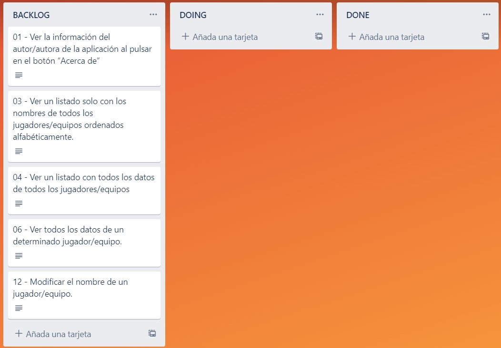

## *Añadida HU-01*

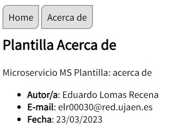

## *Añadida HU-04*

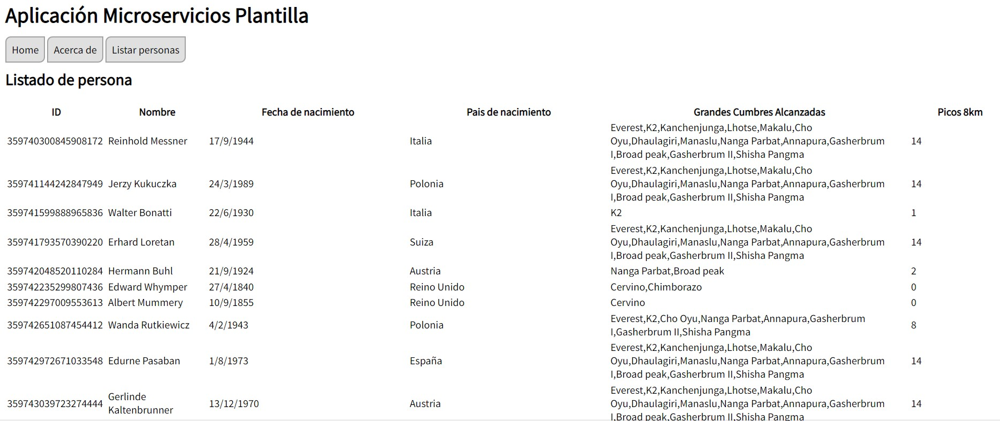

## *Añadida HU-06*

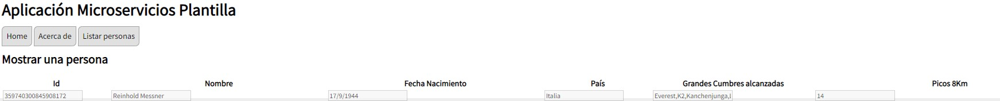

Fin de incremento


# Incremento 2

En este segundo incremento he implementado las historias de usuario 12, 13, 2, 3 y 7. Estas dos últimas no las tenía primeramente en el BACKLOG, pero durante la iteración las he implementado.


## *Añadida HU-12*

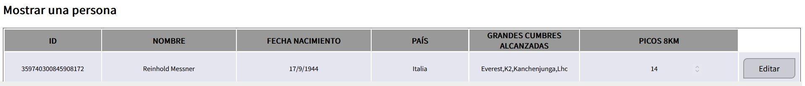
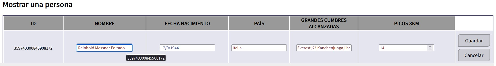
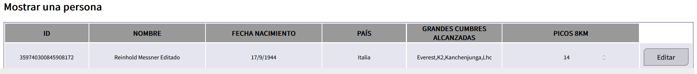

## *Añadida HU-13*

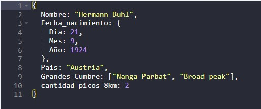
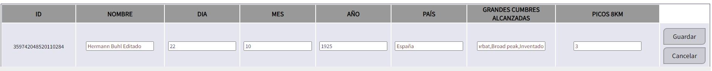
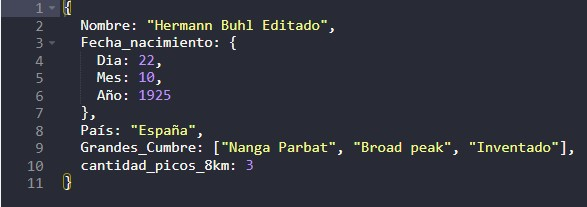

## *Añadida HU-03*

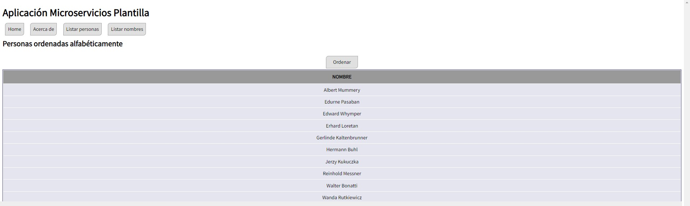

## *Añadida HU-02*

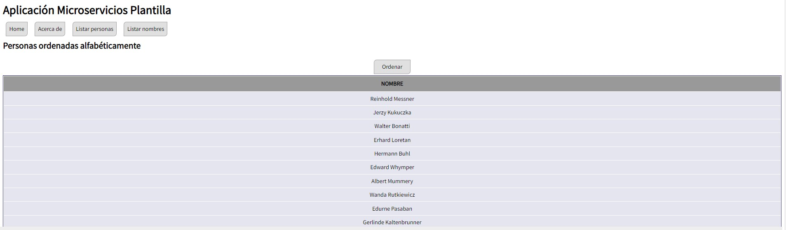

Esta historia de usuario he decidido implementarla ya que anteriormente había implementado la HU-3 y haciendo una pequeña modificación podía implementar las dos mostrando solo los nombres sin ordenar y poniendo un botón que haga que se muestren ordenados.

## *Añadida HU-07*

Esta historia de usuario la he implementado a pesar de no tenerla inicialmente en el BACKLOGe ya que se me ocurrió una idea para implementarla facilmente, por lo que decidí implementarla inmediatamente.

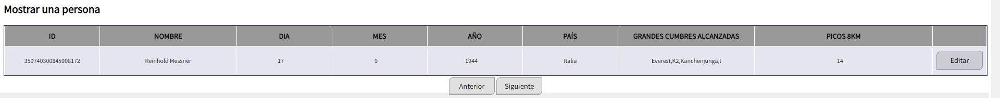
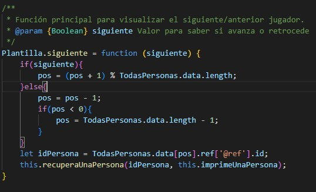

Fin de incremento

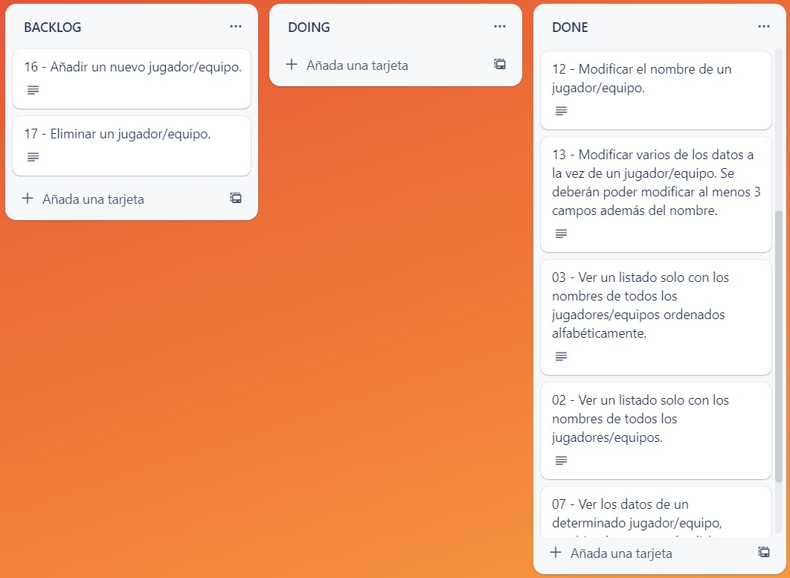

# Incremento 3

En este incremento realizo la HU-8 en la que se puede hacer una búsqueda por nombre de la lista de jugadores.

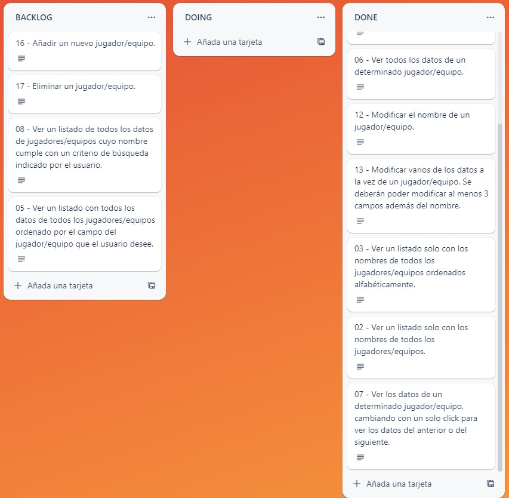

## *Añadida HU-08*

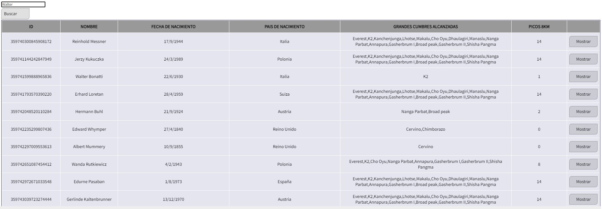
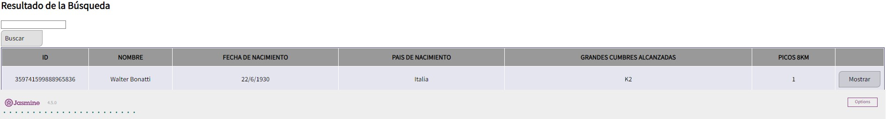

Fin de incremento

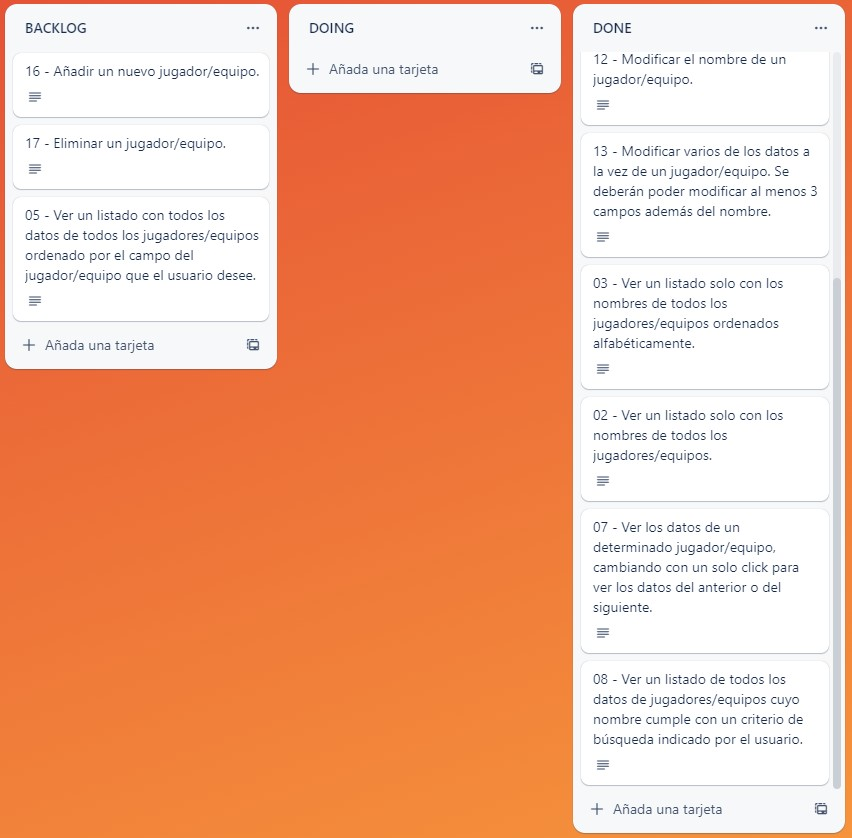